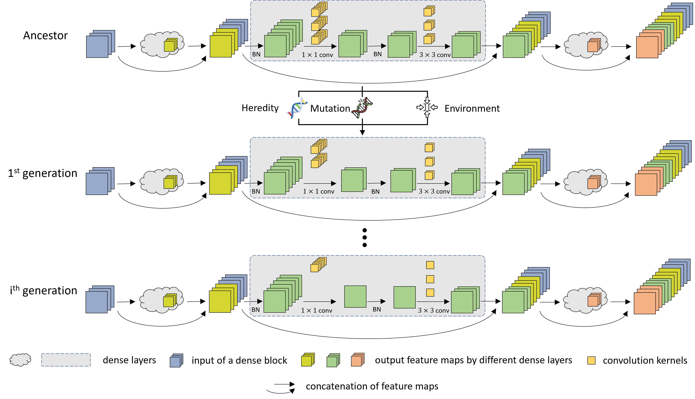
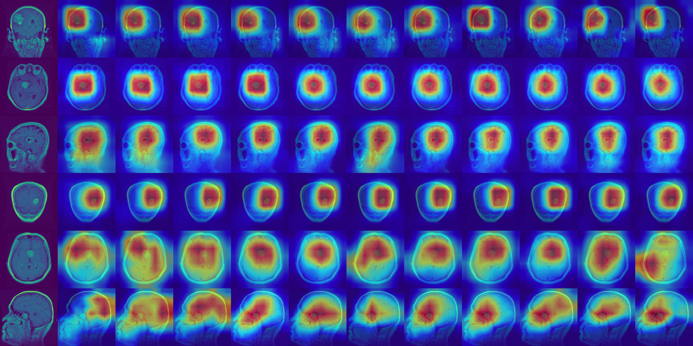
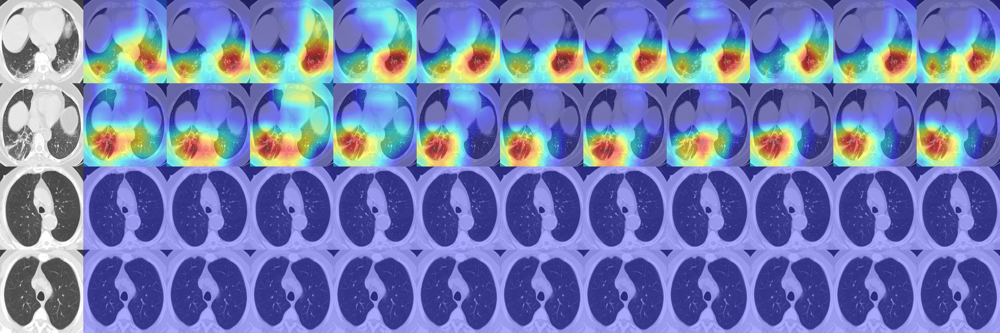

# MEEDNets: Medical Image Classification via Ensemble Bio-inspired Evolutionary DenseNets

This is an implementation of MEEDNets published in [Knowledge-Based Systems](https://www.sciencedirect.com/science/article/pii/S0950705123007852).

## Introduction
Inspired by the biological evolution, this paper proposes an evolutionary synthesis mechanism to automatically evolve DenseNet towards high sparsity and efficiency for medical image classification. Unlike traditional automatic design methods, this mechanism generates a sparser offspring in each generation based on its previous trained ancestor. Concretely, we use a synaptic model to mimic biological evolution in the asexual reproduction. Each generation's knowledge is passed down to its descendant, and an environmental constraint limits the size of the descendant evolutionary DenseNet, moving the evolution process towards high sparsity. Additionally, to address the limitation of ensemble learning that requires multiple base networks to make decisions, we propose an evolution-based ensemble learning mechanism. It utilises the evolutionary synthesis scheme to generate highly sparse descendant networks, which can be used as base networks to perform ensemble learning in inference. This is specially useful in the extreme case when there is only a single network. Finally, we propose the MEEDNets (**M**edical Image Classification via **E**nsemble Bio-inspired **E**volutionary **D**ense**Nets**) model which consists of multiple evolutionary DenseNet-121s synthesised in the evolution process. Experimental results show that our bio-inspired evolutionary DenseNets are able to drop less important structures and compensate for the increasingly sparse architecture. In addition, our proposed MEEDNets model outperforms the state-of-the-art methods on two publicly accessible medical image datasets.

## Citation

    @article{zhu2023meednets,
       title={MEEDNets: Medical Image Classification via Ensemble Bio-inspired Evolutionary DenseNets},
       author={Zhu, Hengde and Wang, Wei and Ulidowski, Irek and Zhou, Qinghua and Wang, Shuihua and Chen, Huafeng and Zhang, Yudong},
       journal={Knowledge-Based Systems},
       pages={111035},
       year={2023},
       publisher={Elsevier}
     }

## MEEDNets

## Evolution Process

## Visual Explanations

